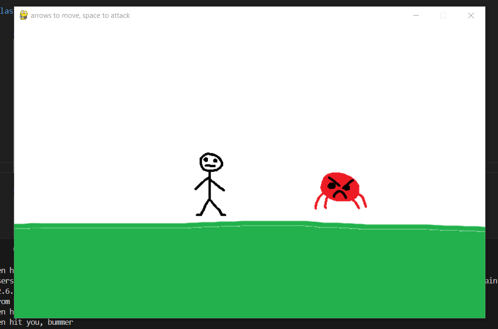

# William Stiner's Final Project
## CS110 Final Project  Semester 1, 2024

Team Members:
William Stiner

***

A simple game with a controllable character, and at least one level that the character can interact with.

***    

## Gui Design

Initial Design

Final GUI Design:

## Program Design

Features:
1. controllable character
2. at least one level
3. objects you can interact with
4. enemies
5. original sprites

Classes:
- Player: class for main playable character
- Enemy: class for enemy you fight in the game

## ATP

Test 1: run program
Test Description: verify that the program starts up and runs properly
Steps:
- step 1: go to the terminal
- step 2: navigate to the project folder
- step 3: type in "python main.py"
Expected outcome: the program starts, a GUI window opens and it runs

Test 2: player moves left
Test Description: verify that the player moves to the left when the user inputs the left key
Steps:
- step 1: run the program
- step 2: press the left arrow key
- step 3: verify that the player moves to the left
Expected outcome: the player on screen moves to the left

Test 3: player moves right
Test Description: verify that the player moves to the right when the user inputs the right arrow key
Steps:
- step 1: run the program
- step 2: press the right arrow key
- step 3: verify that the player moves to the right
Expected outcome: the player on screen moves to the right

Test 4: player attacks
Test Description: verify that the player attacks (the sprite changes) when the user presses the space bar
Steps:
- step 1: run the program
- step 2: press the space bar
- step 3: verify that the player attacks (the sprite changes to the attacking one)
Expected outcome: the player attacks when the space bar is pressed

Test 5: collision between player and enemy
Test Description: verify that the program registers when the player and enemy collide and responds accordingly
Steps:
- step 1: run the program
- step 2: wait until the enemy sprite touches the player sprite, without pressing space
- step 3: verify that the enemy moves back to where it spawned and that the "alien hit you" message prints
- step 4: wait until the enemy sprite touches the player sprite, pressing space this time
- step 5: verify that the enemy moves back to where it spawned and that the "you hit alien" message prints
Expected outcome: the enemy goes back to where is spawned whenever the two sprites collide, alongside the proper message printing

